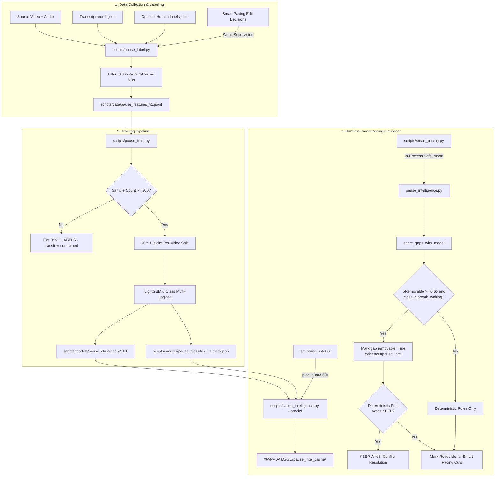

# AutoShorts 11.0: Pause Intelligence Classifier Integration Design Specification

**Date:** 2026-10-03  
**Author:** AutoShorts Integration Team  
**Status:** Approved  
**Feature:** Learned Pause Classifier Integration into Smart Pacing  
**Scope:** Scope-Locked (Evidence-Only, Keep-Wins Deterministic Invariant)

---

## 1. Executive Summary & Goals

In AutoShorts 11.0, Smart Pacing uses a suite of 17 deterministic rules to detect and compress dead air, breath pauses, and hesitation gaps in candidate clips. While `scripts/pause_intelligence.py` provides feature extraction infrastructure and Silero VAD integration, the learned classifier pipeline has remained unintegrated because no trained model existed and no labeling/training tooling was operationalized.

This specification details the end-to-end integration of a **LightGBM 6-class pause classifier** into Smart Pacing:
1. **Dataset Collection Pipeline (`scripts/pause_label.py`)**: Gathers and labels 23 acoustic and structural features from audio and transcripts, supporting human annotations with automated weak-supervision fallback from the engine's confident edit decisions. Supports single-clip CLI mode and `--corpus` batch aggregation.
2. **Multi-Class Training Engine (`scripts/pause_train.py`)**: Trains a 6-way LightGBM classifier with strictly disjoint per-video cross-validation splits to prevent speaker leakage, enforcing a strict $\ge 200$ labeled gap minimum and refusing to fabricate synthetic data.
3. **Rust Sidecar & Caching Layer (`src/pause_intel.rs`)**: Wraps the Python inference engine in a bounded sidecar (`proc_guard::run_bounded`, 60s timeout) with persistent disk caching under `%APPDATA%/com.autoshorts.desktop/pause_intel_cache/`.
4. **Smart Pacing Integration (`scripts/smart_pacing.py`)**: Evaluates model predictions as **evidence only**. When $P(\text{removable}) \ge 0.65$ and predicted class $\in \{\text{breath\_pause}, \text{waiting\_pause}\}$, marks the gap as removable. Deterministic safety rules remain authoritative: **keep always wins on conflict**.
5. **Feature Flag & Safety Defaults (`src/lib.rs`)**: Gated behind `AUTOSHORTS_SMART_PACING_LEARNED`, defaulting to **disabled (unset = disabled)** to guarantee byte-identical fallback for legacy suites and production renders.

---

## 2. Global Constraints & Invariants

1. **Keep-Wins-On-Conflict**: Deterministic safety rules (speech buffer protection, minimum duration, leading/trailing hold, audio verification, crossfade) are authoritative. The classifier cannot veto a deterministic keep.
2. **Scope Lock**: No changes to `llm.rs`, `models.rs`, `db.rs` (schema), `speaker_tracker.py`, `speaker_intelligence.rs`, `captions.rs`, `boundary.rs`, `pacing.rs` (Rust), `vlm_scoring.rs`, `candidate_redundancy.rs`, `render_qa.rs`, `youtube.rs`, `transcription.rs`, `scene_intelligence.rs`, `t7_prosody.py`.
3. **No Database Changes**: No new SQLite tables or schema migrations. Pause intelligence scores and caches are ephemeral.
4. **No Public Rust Module Exposure**: `pause_intel.rs` is declared as `mod pause_intel;` (private), not `pub mod`.
5. **No Frontend Modifications**: Zero changes under `autoshorts/src/`.
6. **No Committed Trained Models**: Only scripts, schemas, and directories are checked in. Artifacts are generated and cached at runtime.
7. **No Fabricated Training Data**: Training data originates strictly from human annotation or documented weak supervision rules. Script exits cleanly with code 0 (`"NO LABELS — classifier not trained"`) if $< 200$ samples are found.
8. **openSMILE Exclusion**: Only Silero VAD (MIT) + NumPy + LightGBM are permitted per Atria licensing requirements.
9. **Removable Category Gate**: Only `breath_pause` and `waiting_pause` are considered reducible. `sentence_pause`, `normal_word_gap`, `nonspeech_unknown`, and `speaker_transition` never trigger removal.
10. **Bounded Subprocess Timeouts**: All sidecar executions are bounded by `proc_guard::run_bounded` (60s timeout).

---

## 3. System Architecture & Data Flow



---

## 4. Component Details

### 4.1 Labeling Pipeline: `scripts/pause_label.py`

#### Interface & Arguments:
```bash
python scripts/pause_label.py <source_path> <words_json> [--labels <human_labels.jsonl>] [--out <output_jsonl>] [--corpus]
```

#### Responsibilities:
1. **Gap Extraction**: Calls `breath_detect.detect_gaps` to discover candidate word gaps in absolute source seconds.
2. **Feature Extraction**: Calls `pause_intelligence.build_gap_features` to compute the 23-element feature vector:
   `["gapRmsDb", "preSpeechRmsDb", "postSpeechRmsDb", "hfRatio", "flatness", "zcr", "dipDb", "levelDropDb", "durationSec", "speakerChange", "endsSentence", "endsClause", "startsFiller", "endsFiller", "preSpeechRate", "postSpeechRate", "relPosInClip", "vadSpeechProb", "vadSilenceFrac", "evHfRatio", "evAboveFloorDb", "evContrastDb", "evFlatness"]`.
3. **Gap Filtering**: Strictly discards gaps with `duration < 0.05s` (too short to categorize) or `duration > 5.0s` (handled by macro-chunking).
4. **Label Resolution**:
   - Matches gap against human labels by `(sourceHash, gapIdx)` or time interval overlap.
   - If no human label exists: generates weak supervision label:
     - If engine removed the gap with confidence $\ge 0.70$ and $HF \ge 0.15 \rightarrow \text{breath\_pause}$.
     - If engine removed the gap with confidence $\ge 0.70$ and $HF < 0.15 \rightarrow \text{waiting\_pause}$.
     - If engine kept the gap and ends sentence $\rightarrow \text{sentence\_pause}$.
     - If engine kept the gap and within sentence $\rightarrow \text{normal\_word\_gap}$.
     - Speaker change $\rightarrow \text{speaker\_transition}$.
     - Set `weakSupervision = True`.
5. **Output Record Schema (`scripts/data/pause_features_v1.jsonl`)**:
   ```json
   {
     "sourceHash": "a1b2c3...",
     "gapIdx": 0,
     "srcStartSec": 12.45,
     "srcEndSec": 13.10,
     "features": [ -34.2, -22.1, -21.8, 0.45, ... ],
     "label": "breath_pause",
     "labelSource": "weak_supervision_engine_decision",
     "weakSupervision": true,
     "timestamp": "2026-10-03T08:50:00Z"
   }
   ```
6. **Corpus Aggregation (`--corpus`)**: Crawls available project transcripts and video sources, appending labeled rows to the master dataset.

---

### 4.2 Training Pipeline: `scripts/pause_train.py`

#### Interface & Arguments:
```bash
python scripts/pause_train.py [--data <dataset_jsonl>] [--models-dir <models_dir>]
```

#### Responsibilities:
1. **Safety Sample Count Gate**: Reads `scripts/data/pause_features_v1.jsonl`. If total valid rows $< 200$, prints `NO LABELS — classifier not trained` and exits cleanly with `sys.exit(0)`.
2. **Disjoint Per-Video Validation Split**:
   - Groups records by `sourceHash`.
   - Uses `GroupShuffleSplit` (or `GroupKFold`) with `test_size=0.20` so that **all gaps from any given video exist exclusively in either train or test, never both**.
3. **Model Configuration**:
   - Library: `lightgbm.LGBMClassifier` or `lightgbm.train`
   - `objective: 'multiclass'`
   - `num_class: 6`
   - `metric: ['multi_logloss', 'multi_error']`
   - `learning_rate: 0.05`
   - `num_leaves: 15`
   - `early_stopping_rounds: 20`
4. **Metrics & Diagnostics**:
   - Computes overall category agreement (accuracy).
   - Computes Removable-Gate Precision and Recall: evaluates binary ability to separate `{"breath_pause", "waiting_pause"}` from the other 4 classes.
   - Computes 6-class confusion matrix and per-class precision/recall.
   - Calculates weak supervision ratio.
5. **Model Export**:
   - Text model: `scripts/models/pause_classifier_v1.txt`.
   - Sidecar metadata: `scripts/models/pause_classifier_v1.meta.json` with pinned `featureVersion: "1"`, classes, threshold, and metrics.

---

### 4.3 Rust Sidecar & Cache: `src/pause_intel.rs`

#### Struct Definitions:
```rust
#[derive(Debug, Clone, Serialize, Deserialize, PartialEq)]
#[serde(rename_all = "camelCase")]
pub struct PauseIntelGap {
    #[serde(alias = "gap_idx")]
    pub gap_idx: usize,
    #[serde(alias = "src_start_sec")]
    pub src_start_sec: f64,
    #[serde(alias = "src_end_sec")]
    pub src_end_sec: f64,
    #[serde(alias = "p_removable")]
    pub p_removable: f64,
    #[serde(alias = "predicted_class")]
    pub predicted_class: String,
    pub confidence: f64,
    #[serde(default)]
    pub features: Option<serde_json::Value>,
}

#[derive(Debug, Clone, Serialize, Deserialize)]
#[serde(rename_all = "camelCase")]
struct PausePredictPayload {
    #[serde(default)]
    pub model_scored: bool,
    #[serde(default)]
    pub feature_version: Option<String>,
    #[serde(default)]
    pub model: Option<String>,
    #[serde(default)]
    pub gaps: Vec<PauseIntelGap>,
}
```

#### Functions:
1. `pause_intel_cache_dir() -> PathBuf`: Resolves `%APPDATA%/com.autoshorts.desktop/pause_intel_cache/`.
2. `find_sidecar_script() -> Option<PathBuf>`: Locates `pause_intelligence.py`.
3. `find_model_file() -> Option<PathBuf>`: Locates `pause_classifier_v1.txt`.
4. `score_gaps(source_path: &Path, start_sec: f64, end_sec: f64, words: &[TranscriptWord], gaps: &[Value]) -> Vec<PauseIntelGap>`:
   - Validates `crate::pause_intel_enabled()`. Returns `Vec::new()` if disabled.
   - Checks model existence. Returns `Vec::new()` if absent (documented fallback).
   - Checks disk cache. Returns cached vector if hit.
   - Spawns Python sidecar via `proc_guard::run_bounded(&mut cmd, Duration::from_secs(60), "PauseIntel")`.
   - On exit, parses JSON stdout, populates cache, and returns `Vec<PauseIntelGap>`.

---

### 4.4 Smart Pacing In-Process Integration: `scripts/smart_pacing.py`

#### Changes to `_attach_learned_pause_evidence`:
- Wrapped in a comprehensive `try...except` block guarding against missing imports (`lightgbm`, `torch`, `silero_vad`).
- Validates `pi.pause_learning_enabled()`.
- Locates model via `pi.find_pause_model()`.
- Extracts 23 features and invokes `score_gaps_with_model(gaps, rows, model_path)`.
- Updates each gap in-place:
  - `pRemovable = float(...)`
  - `predictedClass = str(...)`
  - `confidence = float(...)`
  - If `g["predictedClass"] in ("breath_pause", "waiting_pause") and g["pRemovable"] >= 0.65`:
    `g["removable"] = True`
    `g["evidence"] = {**g.get("evidence", {}), "pause_intel": True}`
- **Conflict Resolution Rule**:
  - Deterministic safety rules (`min_gap_dur`, `speech_buffer`, `lead_trail_hold`) in `detect_pacing_cuts` evaluate all reducible gaps. If a deterministic rule rejects removal, the gap is kept.
  - Emits telemetry log: `[PauseIntel] gaps_scored=<n> removable=<n> model=<version>`.

---

### 4.5 Scoped Lib Wiring: `src/lib.rs`

- Declares private module:
  ```rust
  mod pause_intel;
  pub use pause_intel::{score_gaps, PauseIntelGap};
  ```
- Exposes flag helper:
  ```rust
  /// Master switch for Pause Intelligence learned classification.
  /// Default: disabled (unset = disabled for safety).
  pub fn pause_intel_enabled() -> bool {
      match std::env::var("AUTOSHORTS_SMART_PACING_LEARNED") {
          Ok(v) => matches!(v.trim().to_ascii_lowercase().as_str(), "1" | "true" | "on"),
          Err(_) => false,
      }
  }
  ```

---

## 5. Test & Verification Plan

### 5.1 Python Suite: `scripts/test_pause_intel_suite.py` (10+ tests)
1. `test_feature_vector_dimension_and_order`: Asserts exactly 23 features in `FEATURE_ORDER`.
2. `test_acoustic_feature_calculations`: Evaluates synthetic gap for RMS, HF ratio, and flatness.
3. `test_labeling_duration_filters`: Rejects $< 0.05$s and $> 5.0$s gaps.
4. `test_weak_supervision_mapping`: Validates mapping of engine decisions to pause classes.
5. `test_trainer_refuses_under_200_samples`: Asserts clean exit code 0 and refusal message.
6. `test_trainer_disjoint_video_partition`: Verifies 0 group overlap between train and test splits.
7. `test_model_export_and_meta_schema`: Verifies LightGBM txt and valid meta.json.
8. `test_model_scoring_removable_classes`: Validates $P(\text{removable})$ summation over breath and waiting.
9. `test_feature_version_mismatch_refusal`: Refuses to load models when featureVersion != "1".
10. `test_predict_cli_json_payload`: Tests CLI output schema and graceful fallback.

### 5.2 Rust Suite: `tests/pause_intel_suite.rs` (8+ tests)
1. `test_missing_model_fallback`: Returns empty vector without error when model is absent.
2. `test_flag_disabled_by_default`: Unset flag returns false; sidecar returns empty immediately.
3. `test_flag_explicit_enable`: Setting `AUTOSHORTS_SMART_PACING_LEARNED=1` enables the subsystem.
4. `test_removable_above_threshold_detected`: Gap with $P \ge 0.65$ and removable class detected.
5. `test_low_confidence_ignored`: Gap with $P < 0.50$ ignored by model.
6. `test_conflict_keep_wins`: Deterministic safety rules prevail over model removable vote.
7. `test_version_mismatch_fails_soft`: Corrupted or mismatched metadata falls back cleanly.
8. `test_serde_roundtrip_pause_intel_gap`: Validates camelCase and snake_case deserialization.

### 5.3 Regression Verification
- Smart Pacing v1 suite: 55/55 passed.
- Smart Pacing 2.0 suite: 108/108 passed.
- Full Rust library test suite: 457 passed, 0 failed.
- Render path with pause intel disabled: Byte-identical ASS and edit decisions.
